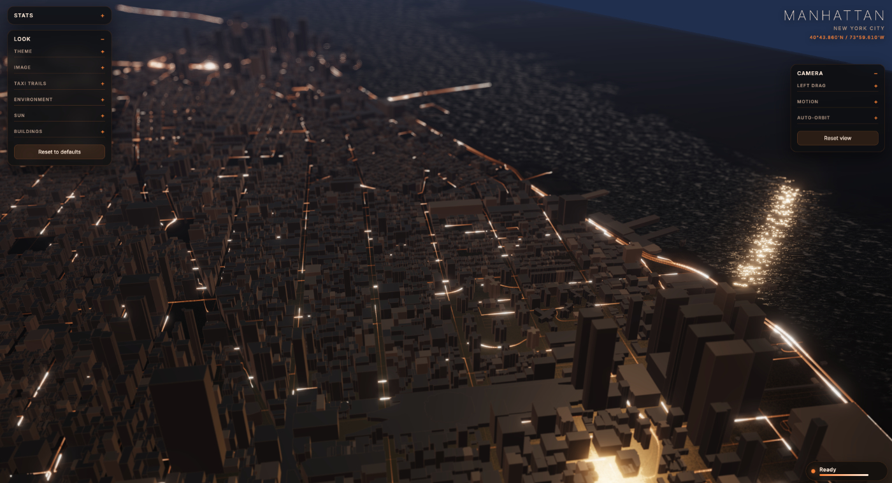
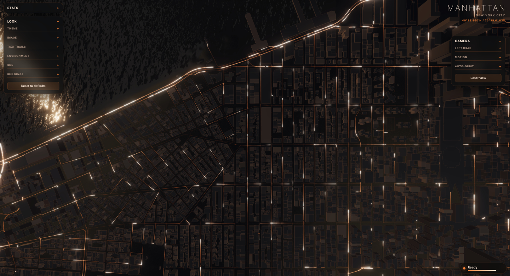
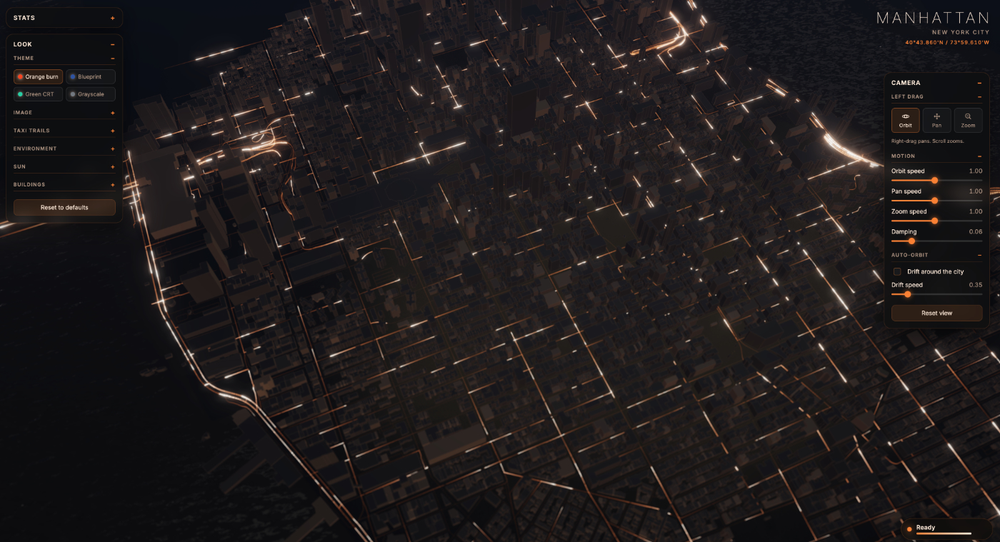

# 3D City Map — Taxi Taxi

A real-time 3D map of Manhattan rendered in the browser, with a fleet of taxis
laying down glowing light-trails along the streets — a long-exposure night
photograph of a city that never holds still. Buildings, roads, and the shoreline
are pulled live from OpenStreetMap; everything else is drawn with Three.js and a
handful of custom shaders.



## What it does

- **Live OpenStreetMap geometry.** Buildings and the street network are fetched
  from the Overpass API for a bounding box over Manhattan, extruded and traced in
  place. The response is cached in the browser's CacheStorage, so it's only
  downloaded once.
- **Taxi light-trails.** ~1,600 taxis drive the real street graph, choosing turns,
  braking for corners, and depositing a decaying heat trail on the road behind
  them — the trail *is* the light, laid on the tarmac like a long exposure. A
  fraction of them pause mid-block and pull away again, and each driver has a
  slightly different cruising speed that drifts over time, so the flow reads as
  traffic rather than a mechanism.
- **Water.** OpenStreetMap doesn't map the Hudson and East Rivers as fillable
  areas — they're `natural=coastline` lines. The water is derived from them as a
  signed-distance field over the ground plane, then rendered with an animated
  simplex-noise swell that calms into the shallows and fades to glass with
  distance. Land sits slightly proud of the waterline with a lit bank.
- **Cinematic look.** Bloom, depth-of-field (bokeh), a reflection probe so the wet
  streets and towers catch the trails, and a painted environment map for the sky
  glow.
- **Four themes**, switchable live: Orange burn (default), Blueprint, Green CRT,
  and Grayscale. A theme is just a bundle of the same values the sliders write, so
  you can pick one and hand-tweak from there.



*Looking down the grid: each street is a drawn line the taxis light up, and the
coastline-derived water ripples along the left edge.*

## Running it

There is **no build step** — it's a static site. Three.js is loaded from a CDN via
an import map, so all you need is a local web server (opening `index.html` from
`file://` won't work because of ES module and CORS rules).

```bash
# from the repo root, pick any one:
python3 -m http.server 8000
# or
npx serve
```

Then open <http://localhost:8000>.

The first load fetches map data from the Overpass API (tens of megabytes) and can
take a little while; subsequent loads read it from the browser cache. Overpass is
a free, rate-limited service — if it's down or throttling, the app falls back to a
synthetic street grid so it always renders something.

## Controls

The scene is driven with the mouse (or one/two fingers on a trackpad):

| Panel | What it controls |
|-------|------------------|
| **Look** (left) | Theme, image (exposure/contrast/bloom/DoF), taxi trail colours and decay, environment and sky, sun, and building appearance. |
| **Camera** (right) | Left-drag mode (orbit / pan / zoom), orbit/pan/zoom speeds, damping, and an auto-orbit drift. "Reset view" flies the camera home. |
| **Stats** (left) | Live scene counters and FPS. |

By default: left-drag orbits, right-drag pans, scroll zooms. The Camera panel
rebinds the left button while always leaving orbit or pan on the right, so you're
never left with no way to turn the city.



*The Look panel (left) and Camera panel (right). Both re-tint with the active
theme.*

## Project layout

```
index.html          Markup, styles, and the Three.js import map
main.js             The whole application: scene, OSM loading, taxi
                    simulation, water field, shaders, and UI wiring
themes/
  index.js          Theme registry — add a file here and list it to add a theme
  ember_theme.js    Orange burn (default)
  blueprint_theme.js
  phosphor_theme.js Green CRT
  grayscale_theme.js
data/
  geo-sample.json   Sample geometry
```

## Configuration

The city, its bounding box, and the taxi count are constants at the top of
`main.js`:

- `BBOX` — the latitude/longitude bounds fetched from OpenStreetMap. Move this and
  the location label follows; the whole scene rebuilds around the new box.
- `TAXI_COUNT` — how many taxis to dispatch.
- `LOCATION` — the name/region shown top-right.

## Built with

- [Three.js](https://threejs.org/) r160 (WebGL), via CDN — no bundler
- [OpenStreetMap](https://www.openstreetmap.org/) data through the
  [Overpass API](https://overpass-api.de/)
- Custom GLSL for the road trails, the water swell, and the land rise

## Credits

Map data © OpenStreetMap contributors, available under the
[Open Database License](https://www.openstreetmap.org/copyright).
